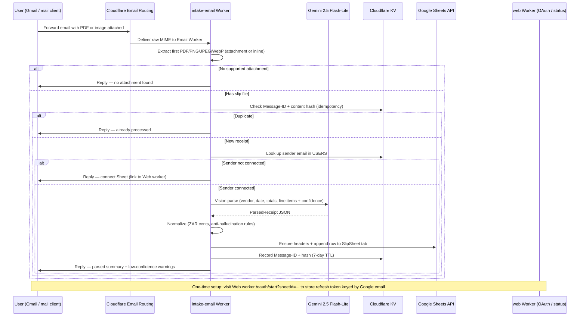

# SlipSheet — How the app works

SlipSheet is a micro-bot for SA freelancers, agencies, and bookkeepers. You **forward a photo or PDF of an invoice or till slip by email**; SlipSheet reads it with Gemini vision, appends a structured row to your Google Sheet, and sends a short confirmation reply.

No app install for senders — only email and a one-time Google Sheet connection.

## End-to-end flow

## What each piece does

| Component | Role |
|-----------|------|
| **Cloudflare Email Routing** | Receives mail at `inbox@yourdomain.com` and invokes the intake worker |
| **`workers/intake-email`** | Parses MIME, runs the pipeline, sends reply emails |
| **`packages/email-intake`** | PostalMime — pulls the first supported attachment or inline image |
| **`packages/parse`** | Calls Gemini, normalizes output, enforces confidence rules |
| **`packages/schema`** | Shared Zod types, Sheet row mapping, confidence helpers |
| **`packages/sheets`** | Google OAuth token refresh, header setup, row append |
| **`workers/web`** | OAuth connect flow, status page, optional CSV export |
| **KV `USERS`** | Refresh token + spreadsheet ID per sender email |
| **KV `IDEMPOTENCY`** | Message-ID and content-hash keys to skip duplicates (7-day TTL) |

## Edge cases

### Duplicate email or file

Before parsing, the worker checks KV for:

1. **Message-ID** — same forwarded message processed again
2. **Content hash** — same file bytes already captured (even if Message-ID differs)

If either matches, the user gets a short reply: *"already processed (duplicate Message-ID or file)"*. No new Sheet row is written.

Some mail clients regenerate Message-ID on resend; the content hash still catches identical files.

### Unknown sender (Sheet not connected)

The sender's **From** address must match a Google account that completed OAuth at the web worker (`/oauth/start?sheetId=...`).

If there is no KV record for that email, processing stops with a reply linking to the web worker to connect a Sheet. Rows are never written to a default or shared Sheet.

### No attachment

The worker looks for the **first** supported file: PDF, PNG, JPEG, or WebP — as a regular attachment or inline image (e.g. photo pasted in the HTML body).

Link-only forwards (URL in body, no file) are rejected with a reply explaining to attach the slip or forward with the attachment included.

### Low confidence / missing totals

Gemini returns each field with a **confidence score (0–1)**. SlipSheet never invents totals:

- Fields below **0.6** confidence are treated as unreliable; totals may be left blank.
- The confirmation reply shows `(not read)` or `(not read — please check manually)` for weak fields.
- A **Low confidence:** line lists field names that need manual review.
- **Warnings** from the parser (e.g. `total_not_visible`, `low_image_quality`) are included in the reply.

Money is stored in the Sheet as **integer cents**; display uses `R x.xx`.

## Local development vs production

### Local development

| Step | What you run | Notes |
|------|----------------|-------|
| Install | `npm install` | Monorepo workspaces |
| Fixtures | `npm run generate:fixtures` | Writes synthetic PDFs/photos + golden JSON under `fixtures/` |
| Build | `npm run build` | Compiles all `packages/*` via `tsc -b` |
| Unit tests | `npm test` | Vitest — schema, parse, idempotency, reply, sheets, email |
| QA sign-off | `npm run qa:slips` | Offline golden checks always; live Gemini if `GEMINI_API_KEY` set |
| Parse one file | `npm run parse -- fixtures/pdf/pdf-invoice-supplier-a.pdf` | Requires `GEMINI_API_KEY` |
| Seed Sheet headers | `npx tsx scripts/seed-sheet-headers.ts` | Optional helper for manual Sheet setup |

Local dev does **not** run the Cloudflare Email Worker unless you use `wrangler dev` on the worker projects. Most logic is tested via packages and Vitest without deploying.

### Production

| Step | Where | Notes |
|------|--------|-------|
| OAuth + status | Deploy `workers/web` | Users visit `/oauth/start?sheetId=...` once |
| Email intake | Deploy `workers/intake-email` | Bound to Email Routing on your domain |
| Secrets | Wrangler | `GEMINI_API_KEY`, Google OAuth, `STATUS_URL` / `APP_URL` |
| KV | Cloudflare | `IDEMPOTENCY`, `USERS` (intake); `USERS`, `OAUTH_STATE` (web) |
| User action | Email only | Forward from the **same** address used in OAuth |

See **[DEPLOY.md](DEPLOY.md)** for the full checklist.

## Data handling (v1)

- Receipt bytes are processed **in memory** on the worker — no long-term file storage.
- Parsed rows live in **your** Google Sheet; SlipSheet stores OAuth refresh tokens and idempotency keys in KV only.
- CSV fallback: POST parsed JSON to `/export.csv` on the web worker when Sheet append is not used.

## Related docs

- [README.md](../README.md) — repo layout and quick start
- [DEPLOY.md](DEPLOY.md) — production deploy steps
- [review/integration-qc.md](review/integration-qc.md) — latest integration QC report
