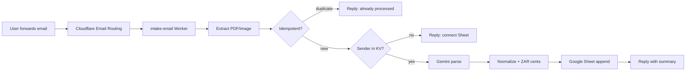

# SlipSheet — Handover for River

**Repo:** https://github.com/RickyNiemandt/SlipSheet  
**Branch:** `main`  
**Last reviewed:** 2026-09-19 (5 parallel QC passes)  
**Product:** Email-only micro-bot for SA freelancers/bookkeepers — forward invoice/till slip → Gemini parse → Google Sheet row → confirm reply.

---

## Start here (30 minutes)

1. **Clone & verify**
   ```bash
   git clone https://github.com/RickyNiemandt/SlipSheet.git
   cd SlipSheet
   npm install && npm run generate:fixtures && npm run build && npm test && npm run qa:slips
   ```
   Expected: **27/27 tests pass**, **qa:slips 6 offline PASS**.

2. **Understand the flow** — read [FLOW.md](FLOW.md) (sequence diagram + edge cases).

3. **Deploy** — follow [DEPLOY.md](DEPLOY.md) (Cloudflare + Google OAuth).

4. **Deep dives** — section handovers in [internal/handover/](../internal/handover/) (01–05).

---

## How the app works (short version)



**One-time setup:** User visits web worker `/oauth/start?sheetId=…` → Google OAuth → refresh token stored in KV keyed by email. They must forward receipts **from that same email address**.

---

## What's done (code)

| Milestone | Status |
|-----------|--------|
| M1 Repo + fixtures + schema/money | Done |
| M2 Gemini parse + anti-hallucination normalize | Done |
| M3 Google Sheets OAuth + append + CSV fallback | Done |
| M4 Email Worker pipeline + idempotency + reply | Done |
| M5 QA tooling (`npm run qa:slips`) | Done offline; live sign-off pending |
| M6 Deploy docs + CI | Done |
| 3-agent QC (2026-09-18) | Bugs fixed (import, build) |
| 5-agent handover review (2026-09-19) | Reports in `internal/handover/` |

**Health:** 0 blocking code bugs. Workers dry-run deploy after `npm run build`.

---

## What River still needs to do

### P0 — Required before first live user

| # | Task | Notes |
|---|------|-------|
| 1 | **Create real Cloudflare KV namespaces** | `IDEMPOTENCY`, `USERS` (shared by both workers), `OAUTH_STATE` (web only). Replace `000…` placeholders in both `wrangler.toml`. |
| 2 | **Deploy workers** | `npm run build` first, then `wrangler deploy` in `workers/web` and `workers/intake-email`. |
| 3 | **Set URLs** | `APP_URL` and `STATUS_URL` = deployed web worker URL (must match). |
| 4 | **Set secrets** | `GEMINI_API_KEY`, `GOOGLE_CLIENT_ID`, `GOOGLE_CLIENT_SECRET` via `wrangler secret put`. |
| 5 | **Google Cloud OAuth** | Sheets API + redirect URI `{APP_URL}/oauth/callback`. See [DEPLOY.md](DEPLOY.md). |
| 6 | **Domain + Email Routing** | Pick domain/inbox (e.g. `inbox@slipsheet.co.za`). Route to `slipsheet-intake-email`. |
| 7 | **Create Google Sheet tab** | Tab named **`SlipSheet`** must exist — worker seeds headers but does not create the tab. |
| 8 | **E2E smoke test** | OAuth connect → forward real PDF → confirm Sheet row + email reply. |

### P1 — Before calling v1 “shipped”

| # | Task | Notes |
|---|------|-------|
| 9 | **M5 live QA** | Add 3–5 real redacted SA till-slip photos to `fixtures/photos/`. Run `GEMINI_API_KEY=… npm run qa:slips`. PASS = no invented totals. |
| 10 | **Brand decision** | SlipSheet / TillDrop / ParseSlip — affects domain and inbox address. |
| 11 | **Privacy policy stub** | POPIA-light: ephemeral processing, Google as processor, user-owned Sheet. |
| 12 | **Fix doc drift** | See [04-docs handover](../internal/handover/04-docs.md) — README missing `OAUTH_STATE`, `seed-sheet-headers.ts` is print-only. |

### P2 — Nice to have / v1.1

- Worker integration tests (`runPipeline`, OAuth callback)
- PDF-over-image attachment priority when email has multiple files
- Async email queue for large MIME (documented, not implemented)
- Separate `LineItems` Sheet tab
- CI job with `GEMINI_API_KEY` for live PDF QA

---

## Known risks (not bugs — design limits)

| Risk | Mitigation |
|------|------------|
| Duplicate Sheet row if append succeeds but idempotency KV write fails | Manual dedupe; consider recording idempotency before append |
| Race: same file, different Message-IDs | Content-hash dedupe usually catches; not atomic |
| First attachment only in multi-attachment emails | Document for users; add PDF priority later |
| Low-confidence totals blanked (by design) | Reply flags fields for manual review |

---

## Key files map

| Path | Purpose |
|------|---------|
| `packages/parse/` | Gemini + normalize (never invent totals) |
| `packages/sheets/` | OAuth, append, CSV |
| `workers/intake-email/` | Email handler + pipeline |
| `workers/web/` | OAuth connect + `/export.csv` |
| `docs/FLOW.md` | Full flow + edge cases |
| `docs/DEPLOY.md` | Production checklist |
| `scripts/qa-slips.ts` | M5 sign-off runner |
| `internal/handover/01–05` | Detailed section QC reports |

---

## Section handover reports

| # | Report | Scope |
|---|--------|-------|
| 01 | [packages](../internal/handover/01-packages.md) | schema, money, parse, sheets, email-intake |
| 02 | [workers](../internal/handover/02-workers.md) | intake-email, web, E2E flow |
| 03 | [QA & tests](../internal/handover/03-qa-tests.md) | fixtures, CI, M5 status, coverage gaps |
| 04 | [docs](../internal/handover/04-docs.md) | README, FLOW, DEPLOY clarity for new engineer |
| 05 | [deploy readiness](../internal/handover/05-deploy-readiness.md) | P0 checklist, secrets list, blockers |

---

## Contacts / context

- **Stack:** Cloudflare Workers, Gemini 2.5 Flash-Lite, Google Sheets API, PostalMime
- **Non-negotiables:** Integer ZAR cents; never invent totals; idempotent intake; ephemeral files; email-only v1
- **Out of scope v1:** WhatsApp, Telegram, Xero/Sage sync, billing, multi-user orgs

Questions? Start with [FLOW.md](FLOW.md), then [DEPLOY.md](DEPLOY.md), then the numbered handover reports above.
