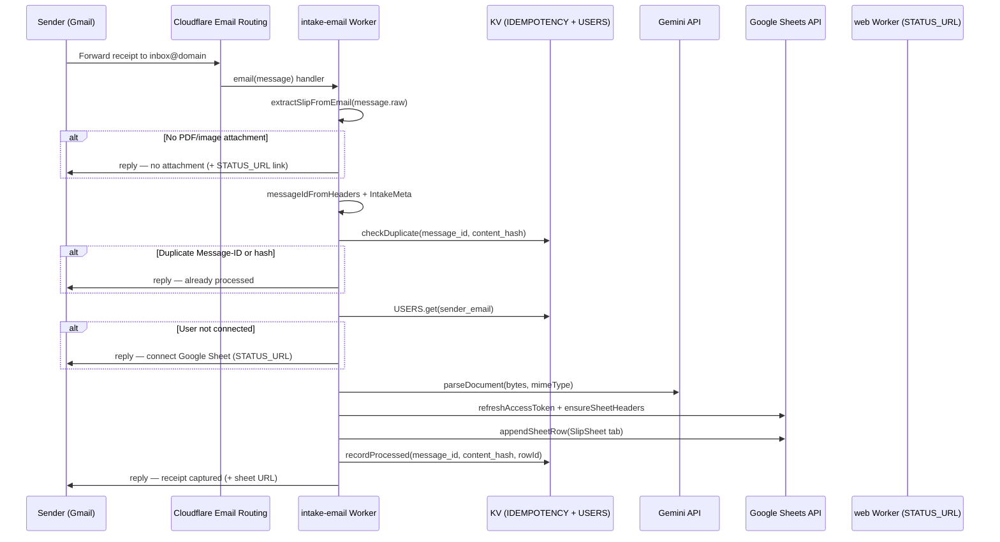
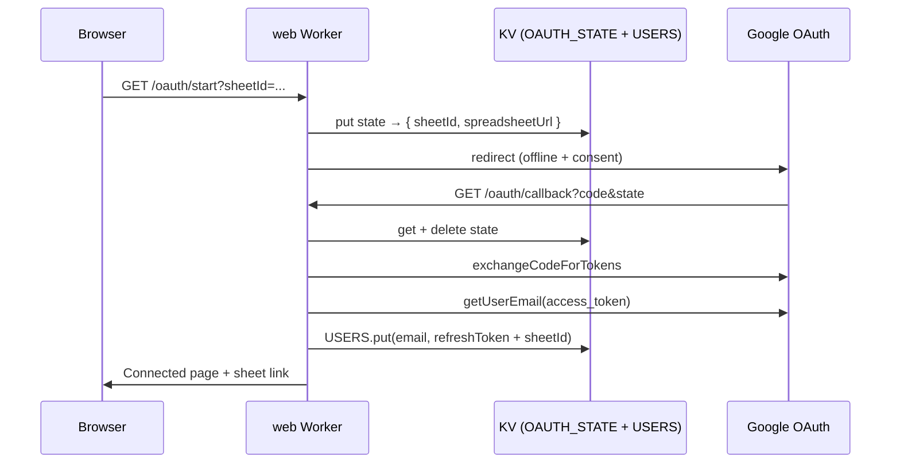

# SlipSheet Workers QC Report

**Date:** 2026-09-18  
**Scope:** `workers/intake-email`, `workers/web`  
**Repo:** [RickyNiemandt/SlipSheet](https://github.com/RickyNiemandt/SlipSheet)

---

## Section health

| Section | Component | Status | Notes |
|---------|-----------|--------|-------|
| **intake-email** | Email handler (`index.ts`) | **PASS** | After import fix; handles no-attachment, duplicate, success, and error replies |
| **intake-email** | Pipeline (`pipeline.ts`) | **PASS** | Hash → idempotency → user lookup → parse → token refresh → headers → append → record |
| **intake-email** | Idempotency (`idempotency.ts`) | **PASS** | Message-ID + content-hash dedupe; 7-day KV TTL |
| **intake-email** | Reply templates (`reply.ts`) | **PASS** | Confirm, error (with STATUS_URL), duplicate |
| **intake-email** | `wrangler.toml` | **FAIL** | Placeholder KV IDs; placeholder `STATUS_URL`; secrets not in config (expected) |
| **web** | Status pages (`/`, `/status`) | **PASS** | Landing + OAuth link |
| **web** | OAuth (`/oauth/start`, `/oauth/callback`) | **PASS** | State in KV (10 min TTL); stores user by lowercased email |
| **web** | CSV export (`POST /export.csv`) | **PASS** | Validates JSON + `ParsedReceipt`; returns attachment CSV |
| **web** | `wrangler.toml` | **FAIL** | Placeholder KV IDs; placeholder `APP_URL`; secrets not in config (expected) |

**Overall:** Logic **PASS** after one code fix. Deploy config **FAIL** until real KV namespace IDs, URLs, and secrets are set.

---

## Email intake E2E flow



### Prerequisite path (OAuth, web worker)



---

## Bindings & environment

### intake-email (`workers/intake-email/wrangler.toml`)

| Binding / var | Type | Configured | Runtime use |
|---------------|------|------------|-------------|
| `IDEMPOTENCY` | KV | Placeholder `000…00` | Dedupe keys `email:{messageId}`, `email:hash:{sha256}` |
| `USERS` | KV | Placeholder `000…01` | Lookup sender → Google refresh token + sheet ID |
| `STATUS_URL` | var | `https://slipsheet.example.com` | Error/confirm links; OAuth redirectUri suffix (unused for refresh) |
| `GEMINI_API_KEY` | secret | Not in toml | `parseDocument` |
| `GOOGLE_CLIENT_ID` | secret | Not in toml | Token refresh |
| `GOOGLE_CLIENT_SECRET` | secret | Not in toml | Token refresh |

### web (`workers/web/wrangler.toml`)

| Binding / var | Type | Configured | Runtime use |
|---------------|------|------------|-------------|
| `USERS` | KV | Placeholder `000…01` | **Must match intake-email USERS namespace** |
| `OAUTH_STATE` | KV | Placeholder `000…02` | OAuth CSRF state (600s TTL) |
| `APP_URL` | var | `https://slipsheet.example.com` | OAuth redirect base |
| `GOOGLE_CLIENT_ID` | secret | Not in toml | OAuth |
| `GOOGLE_CLIENT_SECRET` | secret | Not in toml | OAuth |

**Critical:** Set `STATUS_URL` (intake-email) and `APP_URL` (web) to the **same deployed web worker URL** so error replies link to a working OAuth entry point.

---

## Error paths verified

| Trigger | Worker | Response |
|---------|--------|----------|
| No supported attachment | intake-email | Reply: "no attachment found" + STATUS_URL |
| Duplicate Message-ID or content hash | intake-email | Reply: "already processed" |
| Sender not in USERS KV | intake-email | Reply: "Sheet not connected" + STATUS_URL |
| Parse / Sheets / token failure | intake-email | Reply: "processing failed" + message + STATUS_URL |
| Missing `sheetId` on `/oauth/start` | web | HTTP 400 HTML |
| Missing/expired OAuth state | web | HTTP 400 HTML |
| No refresh token from Google | web | HTTP 400 HTML (revoke + retry) |
| Invalid JSON on `/export.csv` | web | HTTP 400 text |
| Invalid receipt schema on `/export.csv` | web | HTTP 400 text |
| Unknown route | web | HTTP 404 HTML |

---

## Bugs found & fixed

| ID | Severity | Location | Issue | Resolution |
|----|----------|----------|-------|------------|
| W-1 | **Blocker** | `workers/intake-email/src/index.ts` | `KvIdempotencyStore` imported from `./pipeline.js` but defined in `./idempotency.js` — wrangler/esbuild build failed | **Fixed:** import from `./idempotency.js` |
| W-2 | Low | Root `package.json` `build` script | Sequential `tsc -p` per package can skip emit when stale `*.tsbuildinfo` exists but `dist/` is missing | Documented; use `npm run typecheck` (`tsc -b`) before worker deploy |
| W-3 | Low | `workers/web/package.json` | No `build` dry-run script (intake-email has one) | Not fixed; manual `wrangler deploy --dry-run` works |

---

## Deploy blockers

1. **Replace placeholder KV namespace IDs** in both `wrangler.toml` files (`00000000000000000000000000000000` etc.) with IDs from `wrangler kv namespace create`.
2. **Set real URLs:** `APP_URL` and `STATUS_URL` → deployed web worker URL (e.g. `https://slipsheet-web.<subdomain>.workers.dev`).
3. **Set secrets** via `wrangler secret put` on each worker (see `docs/DEPLOY.md`).
4. **Google OAuth redirect URI** must match `{APP_URL}/oauth/callback` exactly.
5. **Email routing** must route `inbox@yourdomain.com` → `slipsheet-intake-email` worker.
6. **Build packages before workers:** `npm run typecheck && npm run build` — workers resolve `@slipsheet/*` from `packages/*/dist/`.

---

## Build & test results

| Command | Result |
|---------|--------|
| `npm run typecheck` | PASS |
| `npm run build` | PASS (after clearing stale tsbuildinfo) |
| `npm test` | PASS — 27/27 tests |
| `workers/intake-email` `npm run build` | PASS (after W-1 fix) |
| `workers/web` `wrangler deploy --dry-run` | PASS |

---

## Residual risks (not fixed)

- **Partial failure:** If `appendSheetRow` succeeds but `recordProcessed` fails, a retry could append a duplicate row (idempotency not yet recorded).
- **Concurrent duplicates:** Two simultaneous emails with the same content but different Message-IDs could both pass hash check before either records (KV race).
- **Sheet tab name:** Hard-coded `"SlipSheet"` tab; sheet must exist or Google API may error.

---

## Files reviewed

```
workers/intake-email/src/index.ts
workers/intake-email/src/pipeline.ts
workers/intake-email/src/idempotency.ts
workers/intake-email/src/reply.ts
workers/intake-email/wrangler.toml
workers/web/src/index.ts
workers/web/wrangler.toml
```

**Change in this QC pass:** `workers/intake-email/src/index.ts` — corrected `KvIdempotencyStore` import.
